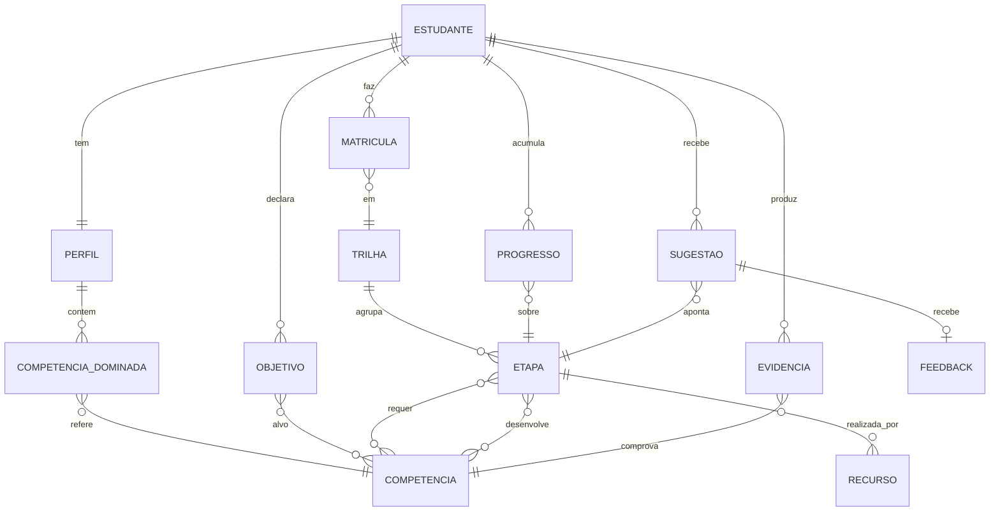

# CONTEXT — Domínio de `trilhas_estudos`

Documento de referência da linguagem e do modelo de domínio. Escrito **antes** da
escolha de stack, e orientado pela primeira capacidade a ser construída: o
**motor de sugestão** (ver [motor-de-sugestao.md](motor-de-sugestao.md)).

Propósito do sistema: **controlar** o avanço de um estudante em trilhas de estudo e
**sugerir** o que estudar em seguida.

---

## 1. Glossário (linguagem única)

Usar estes termos em código, banco, API e conversa. Onde houver um termo em inglês
que provavelmente aparecerá no código, ele está entre parênteses.

| Termo | Definição |
|---|---|
| **Competência** (`Skill`) | Unidade de capacidade verificável, ex. "escrever uma query SQL com JOIN". É o átomo do domínio: pré-requisitos e objetivos são expressos em competências, nunca em etapas. Carrega obrigatoriamente um critério de `verificacao` ([catalogo.md §2](catalogo.md)). |
| **Nível** (`Level`) | Grau de domínio de uma competência numa escala ordinal fixa: `desconhece < iniciante < intermediario < avancado`. |
| **Etapa** (`Step`) | Menor unidade sugerível e concluível de estudo. Exige competências (`requires`) e desenvolve competências (`teaches`). Tem esforço estimado. |
| **Recurso** (`Resource`) | Material concreto que realiza uma etapa (vídeo, capítulo, exercício, projeto). Uma etapa pode ter vários recursos alternativos. |
| **Trilha** (`Track`) | Conjunto ordenado-por-dependência de etapas com um objetivo declarado, ex. "Fundamentos de dados". **Não é uma lista linear**: é um grafo (ver §3). |
| **Objetivo** (`Goal`) | O que o estudante quer alcançar, expresso como competências-alvo com nível-alvo — opcionalmente derivado de uma trilha escolhida. |
| **Perfil** (`Profile`) | Estado declarado + inferido do estudante: competências dominadas e níveis, preferências e restrições. |
| **Restrição** (`Constraint`) | Limite duro do estudante: tempo disponível por semana, idioma, custo máximo, formato aceito. |
| **Matrícula** (`Enrollment`) | Vínculo de um estudante com uma trilha, com data de início e status. |
| **Progresso** (`Progress`) | Registro do avanço: estado por etapa (`nao_iniciada`, `em_andamento`, `concluida`, `abandonada`). |
| **Evidência** (`Evidence`) | Justificativa de que uma competência foi atingida: autoavaliação, exercício correto, projeto entregue, etapa concluída. Carrega data e confiança. |
| **Sugestão** (`Suggestion`) | Recomendação de uma etapa (ou trilha) num instante, com score e **explicação**. É efêmera e auditável, nunca silenciosa. |
| **Feedback** | Reação do estudante à sugestão: `aceita`, `postergada`, `rejeitada` (+ motivo). Alimenta as sugestões seguintes. |

Termos **evitados** por ambiguidade: "curso", "módulo", "aula", "tarefa", "lição".
Tudo que é estudável e concluível é **Etapa**; tudo que é material é **Recurso**.

---

## 2. Entidades e relações

### Atributos que importam para a sugestão

- **Etapa**: `esforco_estimado_min`, `requires[] {competencia, nivel_minimo}`,
  `teaches[] {competencia, nivel_resultante}`, `opcional: bool`.
- **Recurso**: `formato` (vídeo/texto/exercício/projeto), `idioma`, `custo`,
  `duracao_min`, `disponivel: bool`.
- **CompetenciaDominada**: `nivel`, `confianca` (0–1), `ultima_evidencia_em`.
- **Restrição**: `minutos_por_semana`, `idiomas[]`, `custo_maximo`, `formatos_aceitos[]`.

---

## 3. Decisões estruturais do modelo

1. **Trilha é um grafo direcionado acíclico de etapas, não uma sequência.**
   A ordem emerge dos pré-requisitos, o que permite caminhos paralelos, saltos
   quando o estudante já domina algo, e sugestão em vez de "próximo item da lista".
   Registrado em [ADR-0002](adr/0002-trilha-como-grafo-de-etapas.md).

2. **Pré-requisito é sempre entre etapa e competência**, nunca etapa→etapa.
   Isso permite que uma competência adquirida fora da trilha (ou em outra trilha)
   destrave etapas, e evita duplicar conhecimento entre trilhas.

3. **Progresso e domínio são coisas distintas.**
   Concluir uma etapa é um fato de percurso; dominar uma competência é um fato de
   capacidade, sustentado por **evidência** com data. Uma etapa concluída há dois
   anos não equivale a competência atual — é o que permite sugerir revisão.

4. **Sugestão é explicável por construção.**
   Nenhuma sugestão existe sem os fatores que a produziram. Sem isso o sistema é
   inauditável e o estudante não tem como discordar com fundamento.
   Registrado em [ADR-0003](adr/0003-motor-de-sugestao-por-regras-explicavel.md).

5. **Catálogo e percurso são separados.**
   Competências, etapas, recursos e trilhas formam o **catálogo** (compartilhado,
   versionado). Perfil, matrícula, progresso, evidência e sugestão formam o
   **percurso** (por estudante). Editar o catálogo não pode reescrever histórico:
   o percurso referencia `(id, rev)` imutáveis, e o princípio é **fato datado não
   retroage** — autoria, versionamento e a tabela de efeitos de cada mudança estão em
   [catalogo.md](catalogo.md), decididos em [ADR-0004](adr/0004-catalogo-em-yaml-compilado-para-snapshot.md)
   e [ADR-0005](adr/0005-identidade-imutavel-e-depreciacao.md).

---

## 4. Invariantes

- O grafo de pré-requisitos de uma trilha é **acíclico**.
- Uma etapa só é **sugerível** se todos os seus `requires` estão satisfeitos pelo
  perfil no nível mínimo exigido.
- `teaches` de uma etapa nunca rebaixa o nível de uma competência já dominada.
- Toda `CompetenciaDominada` tem ao menos uma `Evidencia`.
- Toda `Sugestao` persiste os fatores de score usados **e a `catalogo_versao`** — reproduzível no tempo.
- Todo id de catálogo é imutável e nunca reaproveitado; entidades são depreciadas, nunca removidas.
- Uma trilha pode ser concluída com etapas `opcional: true` pendentes; nunca com
  etapas obrigatórias pendentes.

---

## 5. Fora de escopo (nesta fase)

Autenticação, multi-tenancy, gamificação, prazos/agenda, social (turmas, ranking),
recomendação por aprendizado de máquina. Nada disso está modelado; ver
[ADR-0003](adr/0003-motor-de-sugestao-por-regras-explicavel.md) sobre ML.
