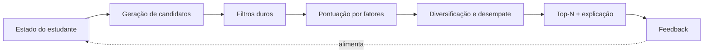

# Motor de sugestão — especificação

Primeira capacidade do sistema. Responde a uma pergunta: **"o que eu estudo agora?"**
Depende do modelo em [CONTEXT.md](CONTEXT.md). Esta é a v1: determinística,
baseada em regras e score explicável ([ADR-0003](adr/0003-motor-de-sugestao-por-regras-explicavel.md)).

---

## 1. Contrato

**Entrada**

```
sugerir(estudante_id, momento, opcoes?) -> Sugestao[]
```

| Campo de entrada | Origem | Uso |
|---|---|---|
| `perfil` | percurso | competências dominadas, nível, confiança, data da última evidência |
| `objetivo` | percurso | competências-alvo; define relevância |
| `matriculas` | percurso | trilhas em andamento; define momentum |
| `progresso` | percurso | etapas concluídas / em andamento / abandonadas |
| `restricoes` | perfil | filtros duros (tempo, idioma, custo, formato) |
| `catalogo` | catálogo | etapas, competências, recursos |
| `feedback_recente` | percurso | sugestões rejeitadas/postergadas |
| `opcoes.quantidade` | chamador | tamanho do top-N (padrão: 3) |
| `opcoes.tempo_disponivel_min` | chamador | sessão de estudo de agora, se informado |

**Saída** — lista ordenada de `Sugestao`:

```
Sugestao {
  etapa_id
  recurso_sugerido_id        # melhor recurso da etapa dadas as restrições
  score                      # 0..1
  fatores: [{nome, peso, valor, contribuicao}]
  explicacao: string         # gerada a partir dos fatores, não escrita à mão
  tipo: proxima_etapa | revisao | retomada | exploracao
  gerada_em
}
```

---

## 2. Pipeline



### 2.1 Geração de candidatos

Une quatro fontes, cada uma marcando o `tipo` da sugestão:

1. **`proxima_etapa`** — etapas não concluídas de trilhas matriculadas cujos
   `requires` estão satisfeitos (fronteira do grafo).
2. **`retomada`** — etapas `em_andamento` (prioridade natural: já há investimento).
3. **`revisao`** — etapas que desenvolvem competências cuja evidência está
   **decaída** (ver §3.6), mesmo que já concluídas.
4. **`exploracao`** — etapas fora das trilhas matriculadas que desenvolvem
   competências-alvo do objetivo. Fonte do valor "sugestão de trilha nova".

### 2.2 Filtros duros

Eliminam candidatos, sem pontuar. Um candidato eliminado deve registrar o motivo —
é o que permite responder "por que isto não apareceu".

- `requires` não satisfeito no nível mínimo (exceto candidatos de `revisao`);
- etapa concluída (exceto `revisao`);
- nenhum recurso da etapa passa as restrições (idioma, custo, formato, disponível);
- etapa rejeitada pelo estudante nos últimos N dias (padrão: 30), salvo se o
  objetivo mudou desde a rejeição;
- `opcoes.tempo_disponivel_min` informado e **nenhum** recurso da etapa cabe nele.

### 2.3 Pontuação

`score = Σ (peso_i × valor_i)`, com `valor_i ∈ [0,1]` e `Σ peso_i = 1`.
Pesos são **configuração**, não constantes no código — serão calibrados com uso.

| Fator | Peso inicial | Mede |
|---|---|---|
| `relevancia` | 0,30 | quanto a etapa aproxima do objetivo (§3.1) |
| `prontidao` | 0,20 | margem entre o que a etapa exige e o que o perfil tem (§3.2) |
| `momentum` | 0,15 | continuidade: mesma trilha / etapa já iniciada (§3.3) |
| `encaixe_de_esforco` | 0,15 | esforço da etapa vs tempo disponível (§3.4) |
| `desbloqueio` | 0,10 | quantas etapas futuras esta destrava (§3.5) |
| `urgencia_de_revisao` | 0,10 | decaimento das competências envolvidas (§3.6) |

### 2.4 Diversificação e desempate

- No máximo **uma** sugestão de `revisao` no top-N, salvo se o decaimento for alto
  em três ou mais competências-alvo.
- No máximo duas sugestões da mesma trilha, para que o top-N não seja só "a próxima
  e a seguinte".
- Empate de score resolve-se por, em ordem: `tipo` (`retomada` > `proxima_etapa` >
  `revisao` > `exploracao`), menor `esforco_estimado_min`, maior `desbloqueio`,
  `etapa_id` (determinismo).

### 2.5 Explicação

Gerada por template a partir dos **dois fatores de maior contribuição** e do `tipo`.
Exemplos do formato pretendido:

- "Você já domina *Modelagem relacional*; esta etapa é o próximo passo de
  *Fundamentos de dados* e destrava 4 etapas adiantes."
- "Você concluiu *JOINs* há 7 meses e não há evidência recente — 25 min de revisão."

Regra: a explicação **nunca** menciona fator que não está em `fatores`.

---

## 3. Definição dos fatores

### 3.1 `relevancia`
Fração das competências-alvo do objetivo alcançadas (direta ou transitivamente)
pelas competências que a etapa desenvolve, ponderada pela distância no grafo:
contribuição `1 / (1 + distancia_em_etapas_ate_o_alvo)`. Sem objetivo declarado,
cai para a relevância em relação às trilhas matriculadas.

### 3.2 `prontidao`
`1,0` quando o perfil excede o nível exigido em exatamente um grau — a zona onde
há desafio sem barreira. Decai quando o perfil apenas empata com o exigido (risco
de dificuldade) e quando excede em muito (risco de tédio). Confiança baixa na
evidência reduz o valor.

### 3.3 `momentum`
`1,0` para etapa `em_andamento`; `0,7` para etapa da trilha mais recentemente
estudada; `0,3` para outra trilha matriculada; `0,0` para `exploracao`.

### 3.4 `encaixe_de_esforco`
Com `opcoes.tempo_disponivel_min`: `1,0` se o melhor recurso ocupa entre 50% e 100%
do tempo; decai fora disso. Sem ele: compara com os `minutos_por_semana` da
restrição e com a duração média das sessões concluídas pelo estudante.

### 3.5 `desbloqueio`
Número de etapas que passam a ter `requires` satisfeito ao concluir esta,
normalizado pelo máximo entre os candidatos da rodada.

### 3.6 `urgencia_de_revisao`
Função crescente do tempo desde a última evidência de cada competência que a etapa
desenvolve, relativa a uma meia-vida por nível (`iniciante` decai mais rápido que
`avancado`). Zero para competências com evidência recente. É o único fator que pode
ressuscitar uma etapa concluída.

---

## 4. Casos de borda

| Situação | Comportamento |
|---|---|
| **Estudante novo, sem perfil nem objetivo** | Não inventar sugestão. Retornar lista vazia com motivo `perfil_insuficiente` e exigir objetivo + autoavaliação inicial. |
| **Objetivo declarado, catálogo sem caminho** | Retornar vazio com motivo `sem_caminho_no_catalogo`, listando as competências-alvo não cobertas (lacuna de catálogo, dado útil). |
| **Todos os candidatos filtrados por restrição** | Retornar vazio com motivo `restricoes_bloqueiam` e qual restrição eliminou mais candidatos. |
| **Trilha concluída** | Candidatos passam a ser `revisao` + `exploracao`; sugerir trilha seguinte por competências-alvo remanescentes. |
| **Etapa abandonada** | Não é `retomada`; volta como `proxima_etapa` com `momentum` zerado e penalidade temporária. |
| **Competência adquirida fora do sistema** | Entra como `Evidencia` de autoavaliação (confiança menor) e destrava etapas normalmente. |
| **Catálogo alterado após conclusão** | Progresso histórico preserva a versão da etapa concluída; sugestão usa a versão atual. |
| **Rejeições repetidas na mesma trilha** | Após 3 rejeições em 14 dias, rebaixar `momentum` da trilha e elevar `exploracao` — sinal de objetivo desalinhado. |

---

## 5. Como isto será verificado

Sem código ainda, mas a especificação só se sustenta se for testável. Os testes da
v1 serão **cenários de catálogo fixo** com asserções sobre ordem e explicação:

1. Perfil vazio + objetivo → primeira etapa sem pré-requisitos da trilha mais curta.
2. Competência destravada fora da trilha → etapa intermediária sugerida, iniciais puladas.
3. Evidência antiga → `revisao` entra no top-3; evidência recente → não entra.
4. `tempo_disponivel_min = 15` → etapa longa filtrada, não apenas despontuada.
5. Rejeição → etapa ausente por 30 dias; mudança de objetivo → volta antes disso.
6. Mesma entrada duas vezes → mesma saída, na mesma ordem (determinismo).
7. Grafo com ciclo no catálogo → erro de validação de catálogo, não laço infinito.

---

## 6. O que deliberadamente não está aqui

- **Aprendizado de máquina / filtragem colaborativa**: inviável e injustificado sem
  volume de dados, e conflita com explicabilidade. Reavaliar quando houver histórico
  real de feedback ([ADR-0003](adr/0003-motor-de-sugestao-por-regras-explicavel.md)).
- **Calibração dos pesos**: os valores da §2.3 são ponto de partida declarado, não
  resultado de medição.
- **Agenda e prazos**: o motor responde "o quê", não "quando".
